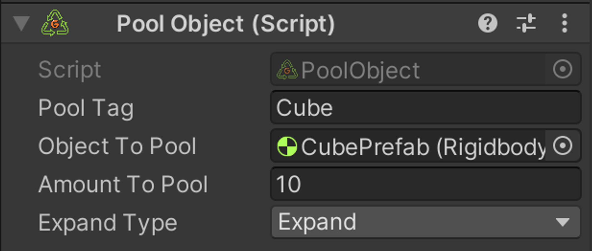
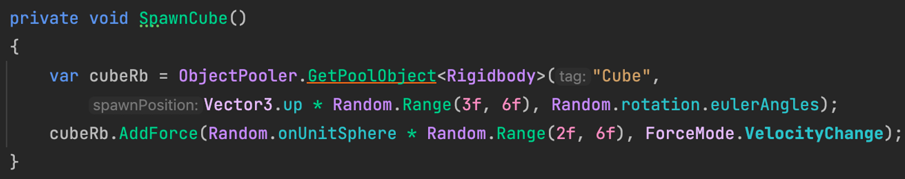
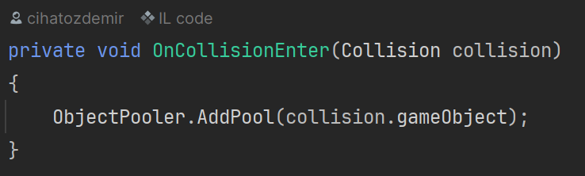

# G-POOLER (OBJECT POOLER)

<p align="center">
  
</p>

## 1. Install / Setup

Package can be installed with Unity Package Manager:
```
  https://github.com/Hot-G/G-Pooler.git#upm
```

### Scene Settings

Drag Object Pooler Prefab to Scene (G-Pooler/Runtime/Prefabs), It’s done!

### 1.1 Create a Pool Object

1. Create a Resources folder (It doesn't matter where you created the folder)
2. Whatever object you want to add to the pool, make it Prefab.
3. Then add the Pool Object Script to Prefab and make the necessary adjustments.

The basic setup should be complete.

### 1.2 Pool Object Settings



- **Pool Tag:** The tag you will use to add or pull the object from the pool.
- **Object To Pool:** The object you want to add to the pool.
- **Amount To Pool:** The number of objects you want to create.

**Expand Type:** There are 3 Expand types:

- None: If there is no object to use, it returns null.
- Expand: If there is no object to use, it creates a new object.
- Use Last: If there is no object to use, it returns the last used object.


## 2 Usage

If you want to pull an object from the pool, you can use the 
```
ObjectPooler.GetPoolObject<T>
```
command.

### 2.1 Example To Get Pool Object



### 2.2 Example To Add Pool


